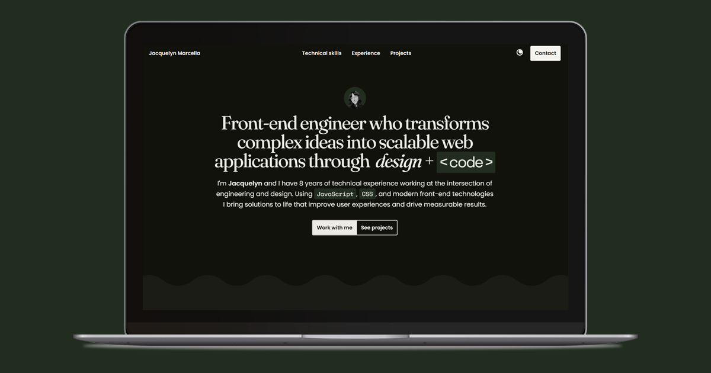
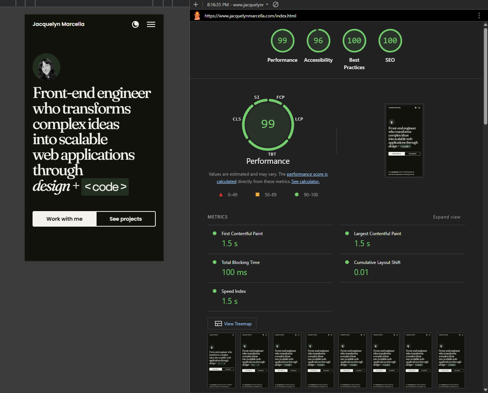

# jacquelynmarcella.com

## Tech stack + process
For my portfolio site, my goal was to keep things clear, readable, and performant. I didn't want to over-engineer the site with complex frameworks given it's size and intended purpose (in my opinion, a React app for this type of site would not be the right tool for the job). I was inspired by clean, editoral designs with hints of playful details. I used the following basic stack:
- HTML5
- CSS3
    - CSS custom properties for spacing, type, and a simple light/dark mode theme (defaults based on browser settings)
    - Mobile-first approach
    - CSS Grid and Flexbox for layout
- JavaScript
- Grunt (including `grunt-bake` for easy inclusion of partial HTML blocks like navigation, footer, etc.)

## Handy assets
The following were super helpful in building consistent type scaling, highlighting code samples, and adding icon animations:
- [Utopia fluid type scale and space calculator](https://utopia.fyi/type/calculator?c=800,14,1.2,1570,18,1.25,6,2,&s=0.75|0.5|0.25,1.5|2|3|4|6,s-l&g=s,l,xl,12)
- [Highlight.js](https://highlightjs.org/)
- [Toggles.dev](https://toggles.dev/)
- [Hamburgers](https://github.com/jonsuh/hamburgers)
- [GSAP](https://greensock.com/gsap/)
- [Google fonts](https://fonts.google.com/)

## Accessibility
Accessibility and consistently growing my understanding of WCAG is a priority for me. I covered the following areas in my build:
- Checked color contrast ratios for all text and background colors (for both light and dark schemes)
- Wrote markup with correct semantic HTML, ensuring proper heading structure
- Ensure all images have `alt` text (or are empty with `aria-hidden` for decorative images) 
- Used proper `aria` and `tabindex` attributes to all interactive elements (top navigation, recommendations carousel)
- Added "skip to main" link to all pages
- Ensured that the tile [block links only included their text content](https://css-tricks.com/block-links-the-search-for-a-perfect-solution/) as the actual link text and had appropriate focus states that did not hide information from screen readers or keyboards
- Ensured that if a user had set `prefers-reduced-motion: true`, that animations were disabled
- Tested experience with NVDA and keyboard only
- Reviewed page in both Lighthouse and WebAIM, addressing acutal issues (note: some contrast issues are present due to it capturing mid-animation state opacity, which I felt was a false positive)

## Lighthouse and page speed
I did the following to ensure the best page speed:
- Used [WebP format](http://www.jacquelynmarcella.com/media-optimization.html) for all images on active pages
- Lazy loaded images below the fold, eager loaded images above the fold
- Minified CSS and JS, loading only the styles needed for different page types

